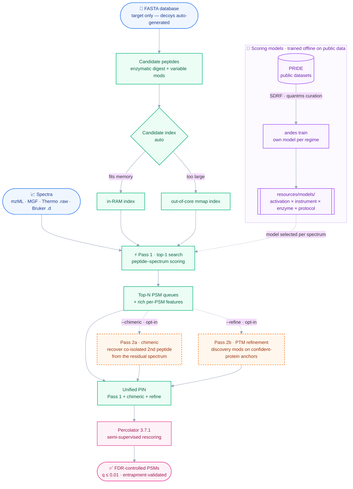

<br clear="left">

_The data-driven peptide search engine of the quantms ecosystem. Built and maintained by the quantms team._

[](https://github.com/bigbio/andes/actions/workflows/ci.yml)
[](https://github.com/bigbio/andes/releases)
[](LICENSE)

> **A fast, data-driven peptide search engine** — spectra (mzML, MGF, native Thermo `.raw`, Bruker timsTOF `.d`) + a FASTA database in, Percolator-ready `.pin` out. Leading PSM counts at 1% FDR, in minutes where comparable Java tools take hours. To our knowledge, the **first proteomics search engine designed and built end-to-end with AI coding agents.**

## What is this?

andes is a peptide-spectrum database search engine for shotgun proteomics. It reads MS/MS spectra (mzML, MGF, native Thermo `.raw`, Bruker timsTOF `.d`), searches them against a FASTA protein database with **data-driven, per-regime scoring models**, and emits Percolator-ready PIN rows (or a TSV) with rich per-PSM features for rescoring. Beyond a fast closed search it offers opt-in **PTM discovery** (`--refine`), **chimeric** co-isolation recovery, multi-enzyme digestion, an out-of-core candidate index for large searches, and zero-config reanalysis — and it returns the most PSMs at 1% FDR on the reference datasets while running roughly 10–40× faster than Java MS-GF+ (that range was measured before the 2026-09-04 tree-count speedup, so it is conservative; see [Why andes?](#why-andes)).

andes is also notable for *how* it was built: its engine, models, and benchmarks were developed iteratively by AI coding agents under human direction — a working demonstration of an agent-built scientific tool.

## Why andes?

Against the canonical open-source engines — **Java MS-GF+ and Comet** — andes leads the field on high-res Astral and low-res TMT, **beats Comet on all three** reference datasets, reads vendor formats natively, and runs in minutes where Java takes hours. The one place andes is edged out is **low-resolution LFQ (UPS1) — Java MS-GF+'s strongest regime** — where andes still beats Comet but trails Java; we report that honestly below. Every engine is re-scored through one uniform Percolator (3.7.1, `--seed 42 -Y`) on the same 8-thread VM, and andes ships a fully own-trained bundle with **own-derived partition geometry** (no MS-GF+ code, constants, or geometry).

Benchmarked at 1% FDR across three reference datasets — **read the metric note under the table before quoting these numbers**:

| Engine | Astral (high-res HCD) | TMT a05058 (low-res CID) | UPS1 (low-res LFQ) |
|---|---:|---:|---:|
| **andes** | **38,394** | **12,281** | 15,838 |
| Comet 2025.01 | 31,435 | 10,504 | 14,734 |
| Java MS-GF+ v20240326 † | 26,542 | 10,651 | **15,904** |
| *andes wall time* | *244 s* | *97 s* | *50 s* |
| *Comet wall time* | *209 s* | *77 s* | *48 s* |

<sub>**Metric.** PSMs at Percolator `q ≤ 0.01` under one methodology for every row (plain FASTA + andes `XXX_` decoys + Percolator 3.7.1 `--seed 42 -Y`). andes and Comet were measured head-to-head on **2026-09-04**, same host, 8 threads, one session, commit `1b8520f8`; andes finds **7.5–22.1% more PSMs** for **1.04–1.26x** Comet's wall time. **†** Java MS-GF+ was not re-run that day; its counts are from the same protocol in an earlier session, and it remains ~10–40x slower than andes. These counts are **not** entrapment-validated: the Astral and TMT databases carry no entrapment component, and on UPS1 the measured true FDP at a nominal 1% is **~3.6%**. N=1 per dataset. Every number, its provenance, the opt-in modes and the glyco tiers: [`docs/benchmarks/`](docs/benchmarks/README.md).</sub>

**On FDR honesty.** Target-decoy q-values are self-consistent by construction, so andes is checked against entrapment databases where one exists — a target PSM matching only a foreign `ENTRAP_` protein is false by construction, which makes the true FDP measurable rather than assumed. That check is real and has repeatedly changed conclusions here. It is also **not uniformly available**: as of the 2026-09-04 audit the Astral benchmark database carries no entrapment component, and the UPS1 one is not 1:1, so the honest summary is that UPS1 sits at ~3.6% true FDP at a nominal 1% and Astral is unvalidated in this configuration. (Opt-in `--refine` PTM discovery runs on top, but its gains are not yet entrapment-validated — the entrapment metric is blind to its peptide-anchored second pass — so it ships as a capability, not a headline number.)

<details>
<summary>Bench methodology</summary>

- **Hardware:** 8-thread Intel Xeon Gold 6238 VM, Linux x86_64. Same machine for every engine.
- **Reproducing these:** exact commands, the shared Percolator protocol and the entrapment arithmetic are in [`docs/benchmarks/`](docs/benchmarks/README.md).
- **Engines:** andes (this repo), Java MS-GF+ [v20240326](https://github.com/MSGFPlus/msgfplus/releases/tag/v2024.03.26), Comet 2025.01 (via OpenMS). Parameters harmonized per dataset (trypsin, ≤2 missed cleavages, matched fixed/variable mods and precursor/fragment tolerances).
- **Uniform FDR:** every engine's PSMs re-scored through the **same** Percolator (`quay.io/biocontainers/percolator:3.7.1--h3b5f4bd_2`, `--seed 42 -Y`), counts at `q ≤ 0.01`. One methodology for every row: plain FASTA, andes `XXX_` decoys, Percolator `-Y` target-decoy competition — which is what makes the rows comparable. Where an entrapment database exists, the true FDP is measured alongside using `ENT/total × (1 + T/E)`; note that `T/E` must be measured per database rather than assumed to be 1, and that not every benchmark database here has an entrapment component (see the metric note under the table).
- **PIN building:** andes and Comet write Percolator PIN directly; Java MS-GF+ via `MzIDToTsv` + `build_pins.py` (its concatenated-TDA mzid crashes `msgf2pin`).
- **Models:** all andes runs use the bundled per-protocol model store (`resources/models/`) — andes's **own models, each trained on public PRIDE data** for the regime it covers (see [Supported models](#supported-models)). The bundle is fully own-trained (no MS-GF+-derived model data).
- **FDR honesty:** counts are at Percolator `q ≤ 0.01` under one methodology for every engine. Where an entrapment database exists the true FDP is measured alongside and reported; see the metric note under the table and [`docs/benchmarks/`](docs/benchmarks/README.md) for which datasets that covers and which it does not.
- **Notes:** Java MS-GF+ is deterministic; the Astral count reuses a prior run (its `msgf2pin` step crashes here regardless of input, and the count is pin-builder-independent). Protein-level counts are omitted from the headline — they require uniform parsimony grouping to be comparable across engines, since raw `proteinIds` differ by output format. Precursor calibration is off (the andes default).

</details>

andes is also the only engine here that reads Thermo `.raw` and Bruker timsTOF `.d` natively. Full methodology, per-engine parameters, data URLs, config files, and the entrapment-FDP validation: [`docs/benchmarks/`](docs/benchmarks/).

## How it works

andes is a streaming, multi-pass search cascade that ends in one uniform Percolator rescoring step.



1. **Candidate generation.** The FASTA is digested into candidate peptides (with variable mods). The candidate index is chosen automatically — kept in RAM, or mapped out-of-core (`mmap`) when it would exceed available memory — so very large mod searches don't OOM (`--candidate-index {auto,ram,mmap}`).
2. **Data-driven scoring.** Each spectrum is scored against its candidates with a model **selected per spectrum** by its `(activation, instrument, enzyme, protocol)`. These are andes's **own models, trained offline on public [PRIDE](https://www.ebi.ac.uk/pride/) datasets** curated through the **[quantms](https://github.com/bigbio/quantms)** / SDRF pipeline — not hand-tuned heuristics.
3. **Pass 1** is the standard top-1 search, emitting top-N PSM queues with rich per-PSM features.
4. **Optional second passes** (opt-in, off by default, do not change the default engine):
   - **`--chimeric`** detects co-isolated precursors in each scan's MS1 isolation window and searches the *residual* spectrum (primary peaks removed) for the **second peptide** — recovering co-isolated IDs without wide-window FDR inflation.
   - **`--refine`** runs a **PTM-discovery** search (oxidation, deamidation, pyro-Glu, acetyl, …) anchored on confident-protein peptides, to rescue modified spectra a closed search misses.
5. **Merge + rescore.** Pass 1 and any second-pass PSMs are written to **one Percolator PIN**; Percolator does the semi-supervised rescoring and FDR control. The reported 1% FDR is independently **entrapment-validated** (true FDP ≈ 1%).

## Install

**Option 1 — download a release archive** (recommended):

Grab the archive for your platform from the [Releases page](https://github.com/bigbio/andes/releases). Five platform builds are published per release:

```
andes-<version>-x86_64-unknown-linux-gnu.tar.gz
andes-<version>-aarch64-unknown-linux-gnu.tar.gz
andes-<version>-x86_64-apple-darwin.tar.gz
andes-<version>-aarch64-apple-darwin.tar.gz
andes-<version>-x86_64-pc-windows-msvc.zip
```

Each archive contains the `andes` binary, the `resources/` tree (the bundled per-protocol model store in `resources/models/`, with all 17 own-trained scoring models), and LICENSE/NOTICE/README.

**Option 2 — `cargo install`:**

```bash
cargo install --git https://github.com/bigbio/andes --bin andes
```

**Option 3 — build from source:**

```bash
git clone https://github.com/bigbio/andes
cd andes
cargo build --release
# Binary: target/release/andes
```

Requires Rust 1.85+ (see `rust-toolchain.toml`).

## Quick Start

```bash
andes \
  --spectrum spectra.mzML \
  --database proteins.fasta \
  --output-pin out.pin
```

This runs a tryptic search with **zero configuration**: for mzML, Thermo `.raw`, and Bruker `.d`, the fragmentation, analyzer resolution, and labeling are read from the file metadata, the matching scoring model is selected automatically, and tolerances default sensibly (`--precursor-tol 20ppm`). It writes Percolator-format PSMs to `out.pin` and per-phase timings to stderr — feed `out.pin` straight into Percolator (Docker or native) to compute q-values.

> **MGF has no instrument metadata**, so for `.mgf` inputs pass the activation explicitly with `--fragmentation <CID\|ETD\|HCD\|UVPD>` (plus `--fragment-tol-ppm`/`--fragment-tol-da`). See [Selecting the scoring model](#selecting-the-scoring-model) for `--protocol` (labeled/enriched samples) and `--model` (pick a model directly).

A row in `out.pin` is one peptide–spectrum match, with rich per-PSM features plus Rust-only additive columns before `Peptide`. The number of charge one-hot columns scales with `--charge` (default **2..5** ⇒ `charge2…charge5`).

### Output scores

Each PSM row carries two scores plus a battery of additive discriminative features for Percolator. The most important columns (full **66-column** reference with per-column value ranges in [`DOCS.md` §3a](DOCS.md)):

| Column | Type | Range | What it is |
|---|---|---|---|
| `RankScore` | int | unbounded | **Ranking** score (rank-LLR) — orders candidates within a spectrum. |
| `RankScoreFloat` | float | unbounded | Unrounded `RankScore` (continuous split-sum) — finer-grained ranking feature for Percolator. |
| `RawScore` | float | unbounded | **Headline discriminative** score (fused `signal − null`) — the feature Percolator weights most. |
| `RawScoreCal` | float | signed | Per-spectrum z-scored `RawScore` (significance). |
| `TailorScore` | float | ≥0 | `RankScore` ÷ spectrum top-1% quantile — cross-spectrum comparability. |
| `DeltaRankScore` | float | ≥0 | Lead of the best peptide over the runner-up. |
| `NumMatchedMainIons`, `longest_b/y` | int | ≥0 | Fragment-coverage counts. |
| `ExplainedIonCurrentRatio`, `matchedIonRatio`, `UniqueMatchFraction` | float | [0, 1] | Fraction-of-signal / fraction-of-peptide explained. |
| `dm`, `absdm`, `MeanErrorTop7` | float | Da / ppm | Precursor & fragment mass-accuracy. |
| `EdgeScore`, `PpmGaussianScore`, `ComplementaryIonBalance`, `ChanceMatchSurprise` | float | varies | Additive evidence features (orthogonal to the core score). |
| `RichIonLLR`, `IntensitySignal`, `FragPred*` | float | model-gated | Intensity-/rich-ion-model features (`0.0` without the model). |
| `PrecursorIsotopeKL`, `PrecursorSNR` | float | ≥0 | MS1 precursor-envelope features (`0.0` without `--chimeric`). |
| `IsRefinement`, `NumMods`, `ModSite*` | int/0-1 | ≥0 | PTM-refinement & mod-localization features (`0` without `--refine`). |

### Run summary & `statistics.log`

Because andes **auto-resolves the model and tolerances from the data**, a run can *end* with different parameters than it started with (precursor calibration tightens the window; a high-res model carries a 20 ppm fragment tolerance even when none was given). At the end of every search andes therefore prints a summary to stderr **and** writes a `statistics.log` next to the PIN, recording the **final** tolerances and a per-modification PSM tally:

```text
──────── andes run summary ────────
  Final precursor tolerance : Symmetric(10.0 ppm) (calibration: Auto)
  Final fragment tolerance  : 0.5 Da
  Spectra with a match      : 48210
  Rank-1 PSMs (pre-FDR)     : 31204 target, 17006 decoy
  PTM report (rank-1 target PSMs carrying each modification):
    Carbamidomethyl : 28933
    Oxidation       :  6120
    Acetyl          :   341
    (unmodified)    :  2150
  ───────────────────────────────────
```

(PTM counts are pre-FDR, over each spectrum's best candidate; Percolator applies FDR downstream.)

## Common workflows

**Tryptic DDA + Percolator** (default):

```bash
andes --spectrum spectra.mzML --database db.fasta --output-pin out.pin
docker run --rm -v $(pwd):/data biocontainers/percolator:v3.7.1_cv1 \
  percolator -X /data/weights.txt /data/out.pin
```

**TMT 10-plex search with mods.txt:**

```bash
andes \
  --spectrum tmt_spectra.mzML \
  --database hsapiens.fasta \
  --output-pin out.pin \
  --mods tmt_10plex_mods.txt \
  --protocol TMT
```

**Direct TSV / Parquet output:**

```bash
# TSV for inspection; OpenMS-compatible QPX .idparquet bundle for quantms/OpenMS
andes --spectrum spectra.mzML --database db.fasta \
  --output-pin out.pin --output-tsv out.tsv --output-parquet out.idparquet
```

`--output-parquet` writes an OpenMS `QPXFile`-schema bundle (`psms`/`proteins`/`search_params` parquet) — see [`DOCS.md` §3e](DOCS.md). andes can emit `.pin`, `.tsv`, and `.parquet` in one run.

**Integrated rescoring → q-values & PEP (`--rescore` / `--rescore-native`):** andes emits the PIN (feature matrix) and hands FDR to a **rescorer**, which joins a **q-value** and **PEP** back into the outputs — the QPX `posterior_error_probability` column, a `q-value` score, and a filtered `<stem>.q<fdr>.tsv` (target PSMs at q ≤ `--fdr`) next to the PIN. Two backends:

- **`--rescore`** — **Percolator** (recommended, production-grade). andes resolves a backend in order: `--percolator-bin <path>` → `percolator` on `$PATH` → the pinned biocontainers docker image (force with `--percolator-docker`). Extra flags pass through `--percolator-args "<...>"`.
- **`--rescore-native`** — a built-in, **Percolator-free** rescorer: a GBDT over the PIN features, trained with **leakage-safe 3-fold target-decoy cross-validation (folded by spectrum)** → q-value + calibrated PEP. A self-contained **fallback** for benchmarking / offline use; Percolator stays the recommended path. On real TMT data it lands within noise of Percolator at a true ≤1% entrapment-FDP.

```bash
andes --spectrum spectra.mzML --database db.fasta \
  --output-pin out.pin --output-parquet out.idparquet \
  --rescore --fdr 0.01            # Percolator; or --rescore-native; or just --fdr 0.01 to auto-pick a backend
```

**`--fdr` auto-picks a backend.** Setting `--fdr` **explicitly** without `--rescore`/`--rescore-native` *triggers* rescoring and auto-resolves: Percolator if one is available, else the native rescorer. So `--fdr 0.01` alone "just works".

**Filtering.** `--fdr <q>` keeps target PSMs at **q-value ≤ q** — the set-level FDR control (default 0.01 when rescoring runs). `--pep <p>` optionally **ANDs** a per-PSM **PEP** (local-FDR) cap on top (kept iff q ≤ `--fdr` *and* PEP ≤ `--pep`); the q-value remains primary, `--pep` is a supplementary gate. Without `--output-pin`, a temporary PIN is used (keep it with `--keep-pin true`).

**With `--chimeric` / `--refine`.** The rescorer reads every PIN row; chimeric secondary and refine Pass-2 PSMs share their scan's `ScanNr`, so the native rescorer's per-spectrum CV folds them with their primary (no decoy leakage) — `--chimeric` rescoring is entrapment-validated for both backends. `--refine`'s Pass-2 is **peptide-anchored**, so a single pooled q-value (Percolator *or* native) is not fully FDR-calibrated for the refined subset (it needs grouped/subset FDR); refine ships as a discovery capability, not an FDR-validated count.

**[quantms](https://github.com/bigbio/quantms) pipeline integration:**

Point quantms's PSM search step at `andes` and use the standard quantms post-processing. The `.pin` row format is the same; existing quantms scripts using legacy numeric flag values (`--fragmentation 3 --protocol 4`) keep working without modification (the legacy numeric flag values are documented in [`DOCS.md`](DOCS.md)).

## Selecting the scoring model

andes picks a per-spectrum scoring model from the bundled store, keyed by `(activation, instrument, enzyme, protocol)`. For **mzML / Thermo `.raw` / Bruker `.d` this is fully automatic** — nothing to set. Three optional flags steer or override it:

- **`--fragmentation <CID\|ETD\|HCD\|UVPD>`** — the activation method. Auto-detected for mzML/`.raw`/`.d`; **only required for MGF**, which carries no instrument metadata.
- **`--protocol <auto\|TMT\|iTRAQ\|iTRAQ-phospho\|phospho\|standard>`** — a hint for **labeled / enriched** samples, so andes selects the TMT/iTRAQ/phospho-aware model. Auto-detected from reporter ions in mzML/`.raw`/`.d`; set it explicitly for MGF or to force a choice. (The MS-GF+ numeric codes `0–5` are still accepted for quantms back-compat but are considered legacy — prefer the names.)
- **`--model <slug>`** — bypass selection and load a specific model from the store (e.g. `--model hcd_qexactive_tryp_tmt`). This is the direct, scalable selector as the model store grows.

The enzyme comes from `--enzyme` (default trypsin). In short: on modern formats you set none of these; on MGF you set `--fragmentation`; `--protocol`/`--model` are there when you want to steer the choice.

### Supported models

The bundle ships **17 fully own-trained scoring models** in `resources/models/` (a per-protocol partitioned Parquet store), each trained on public PRIDE data for the regime it covers — with the partition geometry itself **derived from andes's own corpus** (no MS-GF+ code, constants, or geometry). Earlier bundles also shipped rarer regimes seeded from the original MS-GF+ models; those regimes that could not be retrained from a clean public corpus were **dropped** rather than shipped as seed copies, so the store contains no MS-GF+-derived model data.

For a regime that is not bundled, andes auto-selects the nearest covered model (e.g. a TOF or low-res-ETD enzyme with no dedicated model falls back to the default `hcd_qexactive_tryp`); pass `--model <slug>` to force a specific one.

| `model_id` | activation / instrument / enzyme / protocol | Training data (public PRIDE) | Benchmark |
|---|---|---|---|
| `hcd_astral_tryp` | HCD / OrbitrapAstral / Trypsin / Automatic | PXD046453 | Astral: +22% PSMs vs Comet |
| `hcd_qexactive_tryp` | HCD / QExactive / Trypsin / Automatic | ProteomeTools (PXD009449) | global default model |
| `hcd_qexactive_tryp_tmt` | HCD / QExactive / Trypsin / TMT | PXD010429 | — |
| `hcd_qexactive_tryp_itraq` | HCD / QExactive / Trypsin / iTRAQ | public PRIDE (see manifest) | — |
| `hcd_qexactive_tryp_phosphorylation` | HCD / QExactive / Trypsin / Phosphorylation | public PRIDE (see manifest) | — |
| `hcd_highres_tryp_tmt` | HCD / HighRes / Trypsin / TMT | PXD010429 | — |
| `hcd_highres_nocleavage` | HCD / HighRes / NoCleavage / Automatic | ProteomeTools (PXD009449) | — |
| `hcd_highres_nocleavage_phosphorylation` | HCD / HighRes / NoCleavage / Phosphorylation | ProteomeTools (PXD009449) | — |
| `cid_lowres_tryp` | CID / LowRes / Trypsin / Automatic | PXD009875 + PXD000865 | UPS1 (low-res) |
| `cid_lowres_tryp_tmt` | CID / LowRes / Trypsin / TMT | PXD016999 + PXD014502 + PXD017092 | TMT a05058 (low-res) |
| `cid_lowres_lysc` | CID / LowRes / LysC / Automatic | PXD000865 | ⚠ limited training data |
| `cid_lowres_argc` | CID / LowRes / ArgC / Automatic | public PRIDE (see manifest) | ⚠ limited training data |
| `cid_lowres_gluc` | CID / LowRes / GluC / Automatic | public PRIDE (see manifest) | ⚠ limited training data |
| `etd_highres_tryp` | ETD / HighRes / Trypsin / Automatic | public PRIDE (see manifest) | — |
| `etd_highres_tryp_phosphorylation` | ETD / HighRes / Trypsin / Phosphorylation | public PRIDE (see manifest) | — |
| `etd_lowres_tryp_phosphorylation` | ETD / LowRes / Trypsin / Phosphorylation | public PRIDE (see manifest) | — |
| `uvpd_qexactive_tryp` | UVPD / QExactive / Trypsin / Automatic | public PRIDE (see manifest) | — |

<sub>"public PRIDE (see manifest)" marks regimes whose exact source accession is tracked in the training manifest but not yet pinned in this table; the model is still trained on public data only. Datasets cited as "ProteomeTools" are the synthetic-peptide ProteomeTools deposits (PXD009449 and related).</sub>

> **Quality note — thin-data regimes.** The three rarer-enzyme low-res CID models flagged **⚠ limited training data** (`cid_lowres_lysc`, `cid_lowres_argc`, `cid_lowres_gluc`) are fully own-trained but on a thin corpus: their rank/fragment-offset tables are pseudocount-dominated (the prior carries most of the weight, since few PSMs were available for that exact enzyme+regime). They are independence-clean and usable, but should not be treated as high-confidence, fully-data-driven models on par with the trypsin/TMT/phospho regimes — treat their scoring as best-effort for those enzymes until a larger public corpus is harvested.

## CLI summary

Most-used flags (full reference in `DOCS.md` §1):

Required:

| Flag | Purpose |
|---|---|
| `--spectrum <FILE>` | Input mzML, MGF, Thermo `.raw` (needs `thermo` feature + .NET 8), or Bruker timsTOF `.d` (needs `timstof` feature). Auto-detected by extension |
| `--database <FILE>` | Input FASTA (targets only; decoys generated) |
| `--output-pin <FILE>` | Percolator PIN output |

Optional (default in **bold**):

| Flag | Purpose | Default |
|---|---|---|
| `--output-tsv <FILE>` | Also write a TSV | **none** |
| `--output-parquet <DIR>` | Also write an OpenMS-compatible QPX `.idparquet/` bundle (`psms`/`proteins`/`search_params`) | **none** |
| `--mods <FILE>` | mods.txt file | **Cam-C fixed + Ox-M variable** |
| `--precursor-tol <VALUE>` | Precursor mass tolerance, e.g. `20ppm` or `0.02da` | **20ppm** |
| `--precursor-cal <off\|auto\|on>` | Learn + apply a precursor ppm shift (`auto` skips it when the sample is too small) | **auto** |
| `--isotope-error <MIN..MAX>` | Isotope-error range | **-1..2** |
| `--charge <MIN..MAX>` | Charge range when absent in the spectrum | **2..5** |
| `--enzyme-specificity <fully\|semi\|non-specific>` | Tolerable termini (NTT) | **fully** |
| `--max-missed-cleavages <INT>` | Missed cleavages | **1** |
| `--min-length/-max-length <INT>` | Peptide length range | **6, 50** |
| `--score <auto\|rank\|strong>` | RawScore / ranking source — `auto` picks **strong** for high-res, **rank** for low-res, by the model's instrument | **auto** |
| `--min-peaks <INT>` | Min peaks per spectrum to score | **10** |
| `--top-n <INT>` | PSMs retained per spectrum | **10** |
| `--fragmentation <CID\|ETD\|HCD\|UVPD>` | Fragmentation/activation method — **MGF-only** (auto-detected for mzML/`.raw`/`.d`) | *(see below)* |
| `--protocol <auto\|phospho\|iTRAQ\|iTRAQ-phospho\|TMT\|standard>` | Search protocol | **auto** |
| `--model <SLUG>` | Load a specific model from the store by id (bypass auto-select), e.g. `hcd_qexactive_tryp_tmt` | **auto-pick** |
| `--model-store <PATH>` | Use a custom model store instead of the bundled `resources/models/` | **bundled** |
| `--decoy-prefix <STR>` | Prefix for generated decoys | **XXX_** |
| `--decoy-strategy <reverse\|shuffle\|sequon-reverse\|none>` | How decoys are generated; `sequon-reverse` with `--glyco`, `none` for a pre-built target+decoy FASTA | **reverse** |
| `--enzyme <NAME>` | Digestion enzyme (`trypsin`, `chymotrypsin`, `lysc`, `aspn`, `gluc`, `lysn`, `argc`, `alphalp`, `nocleavage`, `nonspecific`; comma-list for multi-protease) | **trypsin** |
| `--gbdt-max-trees <INT>` | Trees evaluated per GBDT ensemble (`0` = all). 100 is 33–41% faster than all trees and identification-neutral; `--glyco` uses all trees unless set | **100** |
| `--ms-level <INT>` | MS level to search; MS1/MS3+ (e.g. TMT SPS-MS3) filtered out (mzML or `.raw`) | **2** |
| `--threads <INT>` | Worker threads | **logical CPUs** |
| `--chimeric` | Two-pass co-isolated-peptide cascade (mzML or Thermo `.raw`) | **off** — see below |
| `--refine` | PTM-discovery second pass on confident-protein anchors | **off** |
| `--rescore` | Rescore the PIN with **Percolator** → q-value + PEP (see [Integrated rescoring](#common-workflows)) | **off** |
| `--rescore-native` | Rescore with the **built-in** CV'd-GBDT rescorer (no Percolator) | **off** |
| `--fdr <FLOAT>` | q-value cutoff for the filtered TSV; **set explicitly → triggers rescoring + auto-picks a backend** | **0.01** (when rescoring) |
| `--pep <FLOAT>` | optional per-PSM PEP cap, ANDed with `--fdr` | **none** |

Run `andes --help` for the auto-generated help with full descriptions and the legacy numeric flag aliases.

mzML, Thermo `.raw`, and Bruker `.d` are fully auto-detected — andes reads the
activation method and analyzer resolution from the file, so you pass no
fragmentation parameters for these formats.

### MGF input (extended parameters)

MGF files carry no activation or analyzer metadata, so you describe the
acquisition yourself:

| Parameter | When to pass | Example |
|---|---|---|
| `--fragmentation <CID\|ETD\|HCD\|UVPD>` | the activation method used | `--fragmentation HCD` |
| `--fragment-tol-ppm <X>` | high-resolution MS/MS (Orbitrap/TOF) | `--fragment-tol-ppm 20` |
| `--fragment-tol-da <X>`  | low-resolution MS/MS (ion trap)      | `--fragment-tol-da 0.5` |

If you pass none of these for an MGF file, andes assumes CID / low-res / 0.5 Da
and prints a warning. These parameters have no effect on mzML/`.raw`/`.d`.

## Chimeric / co-isolated peptides (`--chimeric`, experimental)

DDA scans frequently co-isolate more than one precursor, and the second peptide is normally lost. With `--chimeric` (mzML or Thermo `.raw`), andes runs a **two-pass cascade**: Pass 1 is the normal top-1 search; Pass 2 then detects co-isolated precursors in each scan's MS1 isolation window (averagine envelope match) and runs a targeted search for the second peptide on the *residual* spectrum (the primary's matched peaks removed), emitting it as an extra PSM. This recovers co-isolated identifications without the FDR inflation of a blind wide-window search — gains are entrapment-FDP validated. It is **opt-in and off by default**; the default engine is unchanged.

**Measured 2026-09-04** (same session as the headline table). On UPS1, the one dataset
with an entrapment database, `--chimeric` raised PSMs at q ≤ 0.01 from 15,838 to 17,112
(+8.0%) while entrapment hits stayed flat (166 → 167) — the extra identifications are real,
not an artifact of the different candidate population the chimeric PIN presents (it forces
`top_n = 1` in pass 1). On Astral the gain is far larger (38,394 → 65,028, +69%) but that
database has no entrapment component, so the Astral figure is **not** entrapment-validated
and should not be read as though it were. Details in
[`docs/benchmarks/`](docs/benchmarks/README.md).

## Soft fragment matching

andes replaces the hard fragment-tolerance cliff with a smooth Gaussian weighting of each matched peak by its mass error, blended toward the missing-ion score — so an off-centre (likely-noise) peak inside a wide low-res window is discounted instead of counting in full. It is **on by default and parameter-free**: the Gaussian width is the model's own match tolerance (`σ = tolerance`), so it scales per regime automatically (meaningful on low-res, ~inert on high-res, which deconvolves to a tight window) with nothing to tune. Measured net-positive across all three regimes when it shipped (2026-08: UPS1 +0.8%, TMT +0.3%, Astral +0.5% at 1% entrapment-FDP).

## Intact N-glycopeptide search (`--glyco`, experimental)

`--glyco` searches **intact N-glycopeptides**: it identifies the peptide backbone and the
attached glycan composition together, from the same MS2 scan, without deglycosylation.

```bash
andes --spectrum sample.mzML \
      --database proteins.fasta \
      --decoy-strategy sequon-reverse \
      --glyco \
      --output-pin results.pin
```

`--glyco` writes **only** `results.glyco.pin`. It is a standalone pipeline: the standard
PIN, TSV, Parquet, rescore and refine outputs are all skipped, and passing
`--output-tsv`, `--output-parquet`, `--rescore` or `--refine` alongside `--glyco` is a
hard error rather than a silently ignored flag.

Two things differ from a normal run:

- **`--decoy-strategy sequon-reverse` is strongly recommended.** Plain reversal maps an
  N-X-S/T sequon to S/T-X-N, so reversed decoys reach the glyco sequon gate at a lower
  rate than targets and q-values come out anti-conservative. `sequon-reverse` restores
  each sequon at its mirrored position, so targets and decoys compete symmetrically.
- **A second PIN is written**, `results.glyco.pin`, alongside the normal peptide PIN.
  Glycopeptide PSMs carry glyco-specific features (oxonium evidence, core-Y ladder,
  glycan-mass agreement, ETD c/z coverage) and must be run through Percolator
  *separately* from the unmodified-peptide PIN — mixing the two feature sets in one
  Percolator run is not valid. andes never computes FDR itself.

Searching several fractions of one experiment? **Run each file separately, concatenate
the `.glyco.pin` files (one header), and run Percolator once on the pooled result.**
A single fraction typically yields only a handful of glyco decoys, which makes a
per-fraction 1% q-value estimate almost pure noise.

### Fragmentation

Both HCD/CID and ETD-family activation are supported, and andes adapts to what it finds:

| Activation | What andes uses |
| --- | --- |
| HCD / CID | oxonium ions, the core-Y ladder, and b/y fragments of the backbone |
| ETD / EThcD / AI-ETD | the above **plus** c/z fragments, which retain the glycan and so localize the glycosite |

On ETD-family data three ETD-only behaviours are on by default and inert on HCD/CID:
`--glyco-cz-gate` (c/z evidence can rescue a backbone from truncation),
`--glyco-etd-rank-glycan` (fragments are predicted at their glycan-carrying mass), and
`--glyco-hcd-pair` (candidate backbones are generated from the paired HCD scan of the
same precursor while c/z is scored on the ETD scan). `--glyco-hcd-pair` needs both scans
in one file and is disabled with a warning for multi-file runs — another reason to search
one file per invocation.

### What to expect

On the pGlyco2 mouse-liver dataset (PXD005553, five fractions, 17,855 reference
glycoPSMs), andes reports **31,666 ± 9 glycoPSMs** at 1% PSM-level q-value from Percolator
and **confirms 78.9% of the reference** (same scan, same backbone), at a measured true
false-discovery proportion of **1.11% ± 0.03** against a 1:1 shuffled entrapment database
— the reported 1% is where it claims to be. Where andes and pGlyco2 identify the same scan,
99.1% agree on the backbone and 83.8% on the full peptidoform (backbone + glycan
composition). Against MSFragger-Glyco's deposited identifications for the same spectra
(PXD031032), andes confirms 88.0% of its glycoPSMs across the five fractions and agrees on
the full peptidoform 95.8% of the time where both identify a scan.

Treat these as a calibration point, not a guarantee. Glyco results depend heavily on
activation type, glycan class, and how the reference set itself was filtered.

### Memory

The glyco path holds the candidate index in RAM; `--candidate-index mmap` is **not yet
supported under `--glyco`** and is rejected rather than silently ignored. Measured on a
20,411-protein human FASTA (whole reviewed proteome):

| Search | Candidates | Peak resident |
| --- | --- | --- |
| plain, 1 missed cleavage | 13.2 M | ~7.8 GB |
| plain, 3 missed cleavages | 18.8 M | ~12.3 GB |
| `--glyco` (raises missed cleavages to 3) | 18.8 M | ~17.3 GB |

So a whole-proteome glyco search wants **~20 GB**. andes now estimates this before
scoring and warns if it will not fit, instead of being killed by the OOM killer half an
hour in with nothing written. If you are short of memory, restrict the FASTA to the
proteins of interest, or pass `--max-missed-cleavages 1` or `2` explicitly — `--glyco`
raises the floor to 3, but an explicit lower value is honoured, and it costs
~4.4 GB less at the price of some IDs.

### Status

`--glyco` is **experimental**. Its flags, defaults and PIN feature set may change between
releases. The glycosite is reported in the Peptide column's glycan tag as `@N<pos>`
(1-based Asn position) **only when the backbone contains a single N-X-S/T sequon**;
with several sequons andes does not localize between them by default and emits `@N?`
rather than a guess. The full flag list, the fused-selector weights, and the
`ANDES_GLYCO_*` rollback switches are documented in
[DOCS.md §9](DOCS.md#9-glycopeptide-search-experimental--advanced-knobs).

## Reading Thermo `.raw` files

andes reads native Thermo `.raw` directly — pass `--spectrum sample.raw`, no other flags; the format is auto-detected by extension just like mzML/MGF, and `--chimeric` works on `.raw` too. Output is parity-identical to searching the equivalent mzML (validated scan-for-scan on a 2.4 GB Orbitrap Astral run).

There are two ways to use it:

- **Pre-built release archives (recommended) — nothing to install.** The macOS (x64/arm64), Windows (x64), and Linux (x64) archives bundle a self-contained .NET 8 runtime next to the binary, so `.raw` reading works out of the box.
- **Building from source** with `--features thermo`. Then `.raw` reading needs the **.NET 8 runtime** installed (the build itself does not need the .NET SDK — the RawFileReader assemblies are vendored):
  - Linux: `sudo dnf install dotnet-runtime-8.0` (RHEL/Fedora) or `apt-get install dotnet-runtime-8.0` (Debian/Ubuntu), or `curl -sSL https://dot.net/v1/dotnet-install.sh | bash -s -- --channel 8.0 --runtime dotnet`
  - macOS: `brew install dotnet@8`
  - Windows: the [.NET 8 Desktop/Runtime installer](https://dotnet.microsoft.com/download/dotnet/8.0)
  - Build needs rustc ≥ 1.88: `RUSTUP_TOOLCHAIN=stable cargo build --release -p andes --features thermo`

The runtime is auto-discovered: a bundled `dotnet/` next to the binary is used automatically; otherwise an existing `DOTNET_ROOT` or a system install is used. mzML/MGF reading never loads .NET. RawFileReader is under Thermo's license — see `crates/input/THERMO_LICENSE.txt`.

**Containers:** base on a .NET 8 runtime image (or add the runtime), e.g.

```dockerfile
FROM mcr.microsoft.com/dotnet/runtime:8.0
COPY andes /usr/local/bin/andes   # built with --features thermo
ENTRYPOINT ["andes"]
```

## Reading Bruker timsTOF `.d` files

andes reads native Bruker timsTOF `.d` (DDA-PASEF) data directly — pass `--spectrum sample.d`, no other flags; the format is auto-detected by extension just like mzML/MGF. A `.d` is a *directory* (a TDF SQLite database plus a binary blob); reading it uses the pure-Rust [`timsrust`](https://crates.io/crates/timsrust) crate, so there is **no vendor runtime and nothing to bundle** — unlike Thermo `.raw`.

It is feature-gated to keep the default build pure-Rust. Build with `--features timstof` on a toolchain with a recent rustc (the `timsrust` dependency tree needs rustc ≥ 1.88):

```bash
cargo build --release -p andes --features timstof
andes --spectrum sample.d --database human.fasta --output-pin out.pin
```

Scope: **MS2 only**, the non-chimeric search path. The ion-mobility dimension is carried as metadata but not used by scoring. `--chimeric` on a `.d` degrades gracefully to a normal search (the co-isolation cascade needs an MS1 stream the DDA reader does not expose), as does `--precursor-cal`. Default (non-`timstof`) builds read mzML/MGF only and never pull in `timsrust`.

## Auto-detection

For mzML, Thermo `.raw`, and Bruker `.d` inputs, andes auto-detects the activation method and analyzer type from file metadata — no fragmentation or instrument parameters are needed. `--protocol` from the CLI is still applied to select protocol-specific models (e.g. TMT, iTRAQ). MGF files carry no activation or analyzer metadata; use `--fragmentation` / `--fragment-tol-ppm` / `--fragment-tol-da` to describe the acquisition (see the MGF section above), or andes defaults to CID / low-res / 0.5 Da and prints a warning. Full resolution table: `DOCS.md` §4.

## Training your own models

andes can generate scoring models from your own data (`andes train`) and select them automatically by instrument at search time — useful for instruments or experiment classes the bundled models don't cover well (Orbitrap Astral, timsTOF, TMT/phospho/immunopeptidomics, …). Models live in a single Parquet store and support incremental add/remove/reweight updates with a held-out acceptance gate. See [`TRAIN.md`](TRAIN.md).

## Citation

If you use andes in published work, please cite:

> bigbio (2026). andes: a data-driven peptide search engine for the quantms ecosystem. https://github.com/bigbio/andes

## License

andes is released under the **Apache License 2.0** — see [`LICENSE`](LICENSE) for the full text and [`NOTICE`](NOTICE) for attribution. 
