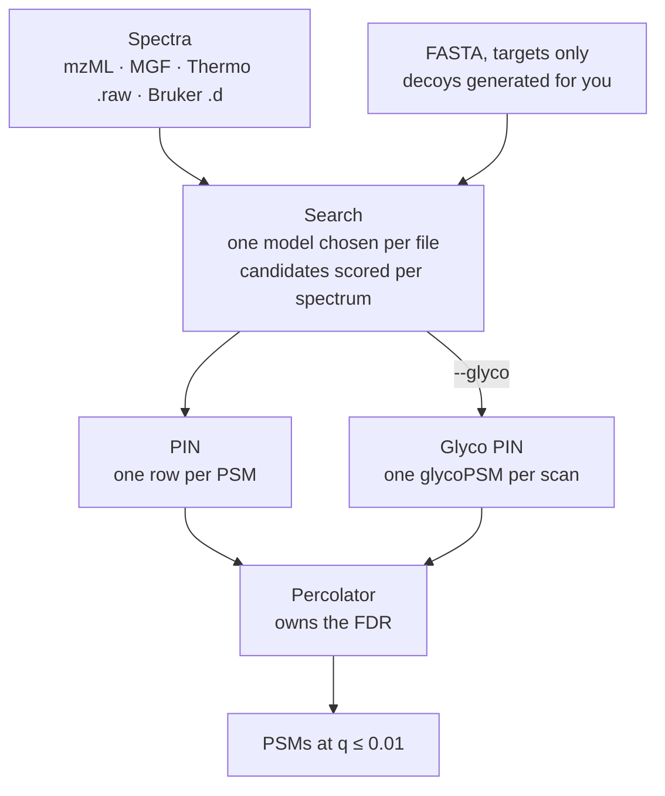

<br clear="left">

_The data-driven peptide search engine of the quantms ecosystem. Built and maintained by the quantms team._

[](https://github.com/bigbio/andes/actions/workflows/ci.yml)
[](https://github.com/bigbio/andes/releases)
[](LICENSE)

andes is a peptide database search engine for shotgun proteomics. Spectra (mzML, MGF, native
Thermo `.raw`, Bruker timsTOF `.d`) and a FASTA go in; a Percolator-ready `.pin` comes out. The
scoring model is picked per file from its metadata. Opt-in modes recover co-isolated peptides
(`--chimeric`), search secondary modifications (`--refine`) and identify intact
N-glycopeptides (`--glyco`). To our knowledge it is the first proteomics search engine designed
and built end-to-end with AI coding agents, under human direction.

## Why andes?

andes finds more PSMs than Comet on all three reference datasets. On low-res LFQ (UPS1), Java
MS-GF+'s strongest regime, it trails Java.

| Engine | Astral (high-res HCD) | TMT a05058 (low-res CID) | UPS1 (low-res LFQ) |
|---|---:|---:|---:|
| **andes** | **47,080** | **12,281** | 15,838 |
| Comet 2025.01 | 31,435 | 10,504 | 14,734 |
| Java MS-GF+ v20240326 † | 26,542 | 10,651 | **15,904** |
| *andes wall time* | *160–161 s* | *53–55 s* | *34–35 s* |
| *Comet wall time* | *215 s* | *76 s* | *46 s* |

<sub>**Metric and provenance.** PSMs at Percolator `q ≤ 0.01`, one method for every row (plain
FASTA, andes `XXX_` decoys, Percolator 3.7.1 `--seed 42 -Y`, same 8-thread host). andes measured
**2026-10-07** at #112 (`40774aca`); Comet on 2026-10-05, reproducing its 2026-09-04 counts.
Since #112, high-res searches retrieve candidates with the fragment-ion index, which moved Astral
from 38,394 to 46,774, and breaking the index's vote ties by matched intensity took it to 47,080;
TMT and UPS1 are unchanged. andes finds 7.5–49.8% more PSMs in 0.70–0.76x
Comet's wall time. **†** Java MS-GF+ was not re-run; its counts are from an earlier session, and it
remains ~10–40x slower. **Error rates:** checked against an entrapment version of the Astral
database, the Astral gain holds at an equal true FDP (+22.2% over the previous in-RAM retrieval at
1.00%; the index's nominal 1% is 1.07% true). TMT has no entrapment component; on UPS1 the true FDP
at a nominal 1% is **~3.6%**, the same rate as Comet's. Details:
[`docs/benchmarks/`](docs/benchmarks/README.md).</sub>

**Time, CPU and memory** (same VM, 8 threads, `/usr/bin/time`; andes 2026-10-07 at #112, two runs
on the standard sets; Comet 2026-10-06, one run). andes uses 36–57% less CPU time than Comet and
17–42% less wall time. It needs less memory on Astral and UPS1, and more on TMT (2x) and phospho
(2.3x, 80 Da index slices).

| dataset | engine | PSMs @ q≤0.01 | wall | CPU time | peak memory |
|---|---|---:|---:|---:|---:|
| Astral | **andes** | **47,080** | **160 s** | **787 s** | **4.1 GB** |
| | Comet | 31,435 | 217 s | 1,594 s | 8.1 GB |
| TMT a05058 | **andes** | **12,281** | **53 s** | **295 s** | 5.9 GB |
| | Comet | 10,504 | 77 s | 568 s | 2.9 GB |
| UPS1 | **andes** | **15,838** | **34 s** | **199 s** | **2.5 GB** |
| | Comet | 14,734 | 42 s | 309 s | 2.9 GB |
| Phospho (PXD007653) | **andes** | **37,190** (1.02% FDP) | **637 s** | **3,608 s** | 13.7 GB |
| | Comet | 33,984 (1.77% FDP) | 1,096 s | 8,399 s | 6.0 GB |

<sub>PSM counts: 2026-10-05 refresh (phospho: seed 42). Wall times vary 5–15% between sessions;
CPU time is steadier.</sub>

## How it works


```mermaid
flowchart TD
    SPEC["Spectra<br/>mzML · MGF · Thermo .raw · Bruker .d"] --> SEARCH
    FASTA["FASTA, targets only<br/>decoys generated for you"] --> SEARCH
    SEARCH["Search<br/>one model chosen per file<br/>candidates scored per spectrum"]
    SEARCH --> PIN["PIN<br/>one row per PSM"]
    SEARCH -->|"--glyco"| GPIN["Glyco PIN<br/>one glycoPSM per scan"]
    PIN --> PERC["Percolator<br/>owns the FDR"]
    GPIN --> PERC
    PERC --> OUT["PSMs at q ≤ 0.01"]
```

1. **Pick the model** from the file's activation, resolution and isobaric label (one of 17
   bundled models).
2. **Build candidates**: digest the FASTA and generate decoys. On high-res data the candidate
   index goes out-of-core (cached in the system temp directory) so candidates can be retrieved by
   the fragment-ion index; on low-res data it stays in RAM unless it would not fit the container
   or scheduler memory limit, in which case the index is used with only the 150 most intense
   peaks voting.
3. **Score**: low-res by the generating-function rank score, high-res by the fused strong
   score, plus GBDT fragment-intensity features. High-res searches score only the 100 candidates
   whose fragment ions best match the spectrum (Astral: +22% PSMs at an equal true FDP; phospho:
   164 s instead of 99 minutes).
4. **Optional passes** `--chimeric`, `--refine` and the separate `--glyco` pipeline (below).
5. **Rescore** with Percolator, run by you or by `--rescore`. andes computes no production FDR.

Full parameter reference: [`DOCS.md`](DOCS.md).

## Install

**Option 1 — [release archive](https://github.com/bigbio/andes/releases)** (recommended):

```
andes-<version>-x86_64-unknown-linux-gnu.tar.gz
andes-<version>-aarch64-unknown-linux-gnu.tar.gz
andes-<version>-x86_64-apple-darwin.tar.gz
andes-<version>-aarch64-apple-darwin.tar.gz
andes-<version>-x86_64-pc-windows-msvc.zip
```

Each archive holds the binary, the 17-model store in `resources/models/`, and LICENSE/NOTICE/README.

**Option 2 — `cargo install`:**

```bash
cargo install --git https://github.com/bigbio/andes --bin andes
```

**Option 3 — build from source:**

```bash
git clone https://github.com/bigbio/andes
cd andes
cargo build --release
# Binary: target/release/andes
```

Requires Rust 1.85+ (see `rust-toolchain.toml`).

## Quick Start

```bash
andes \
  --spectrum spectra.mzML \
  --database proteins.fasta \
  --output-pin out.pin
```

This runs a tryptic search with no configuration: for mzML, `.raw` and `.d` the model is chosen
from the file metadata, and the precursor tolerance defaults to `20ppm`. Feed `out.pin` to
Percolator for q-values.

> **MGF has no instrument metadata.** Pass `--fragmentation <CID\|ETD\|HCD\|UVPD>` plus
> `--fragment-tol-ppm` or `--fragment-tol-da`; otherwise andes assumes CID / low-res / 0.5 Da
> and warns.

Each PIN row is one PSM. `RankScore` orders candidates within a spectrum; `RawScore` is the
score Percolator weights most. All 66 columns are in [`DOCS.md` §3a](DOCS.md#3a-pin-columns).
The final tolerances and a per-modification PSM tally go to stderr and `statistics.log`
([`DOCS.md` §3d](DOCS.md#3d-run-summary-statisticslog)).

## Common workflows

**Tryptic DDA + Percolator** (default):

```bash
andes --spectrum spectra.mzML --database db.fasta --output-pin out.pin
docker run --rm -v $(pwd):/data biocontainers/percolator:v3.7.1_cv1 \
  percolator -X /data/weights.txt /data/out.pin
```

**TMT 10-plex search with mods.txt** (mods file format: [`DOCS.md` §2](DOCS.md#2-modstxt-format)):

```bash
andes \
  --spectrum tmt_spectra.mzML \
  --database hsapiens.fasta \
  --output-pin out.pin \
  --mods tmt_10plex_mods.txt \
  --protocol TMT
```

**TSV and Parquet output:**

```bash
# TSV for inspection; OpenMS-compatible QPX .idparquet bundle for quantms/OpenMS
andes --spectrum spectra.mzML --database db.fasta \
  --output-pin out.pin --output-tsv out.tsv --output-parquet out.idparquet
```

**In-process rescoring.** `--rescore` runs Percolator (`--percolator-bin`, else `percolator` on
`$PATH`, else the pinned Docker image). `--rescore-native` is a built-in cross-validated GBDT
fallback. Both add a q-value and PEP to the outputs and write `<stem>.q<fdr>.tsv` (targets at
q ≤ `--fdr`, default 0.01, e.g. `--rescore --fdr 0.01`). `--fdr` and `--pep` do nothing
without one of them.

**[quantms](https://github.com/bigbio/quantms).** Point the search step at `andes`. Use named
flag values; legacy numeric values are rejected ([`DOCS.md` §8](DOCS.md#8-legacy-numeric-values--behavior-notes)).

## Selecting the scoring model

andes picks a model by `(activation, instrument, enzyme, protocol)`, automatically for mzML,
`.raw` and `.d`. `--fragmentation` is needed only for MGF; `--protocol
<auto\|TMT\|iTRAQ\|iTRAQ-phospho\|phospho\|standard>` selects a labelled or enriched model;
`--model <slug>` loads one model by id (e.g. `hcd_qexactive_tryp_tmt`). The enzyme comes from
`--enzyme` (default trypsin). An uncovered regime uses the nearest model.

### Supported models

All 17 models are trained by andes on public PRIDE data; the store contains no MS-GF+-derived
model data.

| `model_id` | activation / instrument / enzyme / protocol | Training data (public PRIDE) | Benchmark |
|---|---|---|---|
| `hcd_astral_tryp` | HCD / OrbitrapAstral / Trypsin / Automatic | PXD046453 | Astral: +22% PSMs vs Comet |
| `hcd_qexactive_tryp` | HCD / QExactive / Trypsin / Automatic | ProteomeTools (PXD009449) | global default model |
| `hcd_qexactive_tryp_tmt` | HCD / QExactive / Trypsin / TMT | PXD010429 | — |
| `hcd_qexactive_tryp_itraq` | HCD / QExactive / Trypsin / iTRAQ | public PRIDE (see manifest) | — |
| `hcd_qexactive_tryp_phosphorylation` | HCD / QExactive / Trypsin / Phosphorylation | public PRIDE (see manifest) | — |
| `hcd_highres_tryp_tmt` | HCD / HighRes / Trypsin / TMT | PXD010429 | — |
| `hcd_highres_nocleavage` | HCD / HighRes / NoCleavage / Automatic | ProteomeTools (PXD009449) | — |
| `hcd_highres_nocleavage_phosphorylation` | HCD / HighRes / NoCleavage / Phosphorylation | ProteomeTools (PXD009449) | — |
| `cid_lowres_tryp` | CID / LowRes / Trypsin / Automatic | PXD009875 + PXD000865 | UPS1 (low-res) |
| `cid_lowres_tryp_tmt` | CID / LowRes / Trypsin / TMT | PXD016999 + PXD014502 + PXD017092 | TMT a05058 (low-res) |
| `cid_lowres_lysc` | CID / LowRes / LysC / Automatic | PXD000865 | ⚠ limited training data |
| `cid_lowres_argc` | CID / LowRes / ArgC / Automatic | public PRIDE (see manifest) | ⚠ limited training data |
| `cid_lowres_gluc` | CID / LowRes / GluC / Automatic | public PRIDE (see manifest) | ⚠ limited training data |
| `etd_highres_tryp` | ETD / HighRes / Trypsin / Automatic | public PRIDE (see manifest) | — |
| `etd_highres_tryp_phosphorylation` | ETD / HighRes / Trypsin / Phosphorylation | public PRIDE (see manifest) | — |
| `etd_lowres_tryp_phosphorylation` | ETD / LowRes / Trypsin / Phosphorylation | public PRIDE (see manifest) | — |
| `uvpd_qexactive_tryp` | UVPD / QExactive / Trypsin / Automatic | public PRIDE (see manifest) | — |

<sub>"see manifest": the accession is tracked in the training manifest, not yet pinned here.
**⚠ limited training data:** few PSMs were available, so treat these models as best-effort.</sub>

To train your own, see [`TRAIN.md`](TRAIN.md).

## Chimeric / co-isolated peptides (`--chimeric`, experimental)

With `--chimeric` (mzML or Thermo `.raw`), pass 1 is the normal search with `top_n = 1`; pass 2
finds co-isolated precursors in the MS1 isolation window and searches the residual spectrum for
a second peptide.

On UPS1 (with entrapment) PSMs at q ≤ 0.01 rose from 15,838 to 17,112 (+8.0%) with entrapment
hits flat (166 → 167). On high-res data `--chimeric` runs on the default out-of-core path with
fragment-ion retrieval. On Astral with an entrapment database (Percolator, three seeds), at an
equal 1% true FDP, it gives 60,403–60,435 PSMs against 43,076–43,145 without `--chimeric`
(+40%) and 57,003–57,054 with `--chimeric --candidate-index ram`. Distinct peptides stay flat
(26,432–26,454 vs 26,513–26,534): the second-peptide rows mostly re-identify peptides found
elsewhere, which deepens PSM counts rather than coverage. At nominal q ≤ 0.01 the true FDP is
1.18% (1.05% without `--chimeric`).

## Secondary modifications (`--refine`, experimental)

`--refine` searches the spectra pass 1 missed against confident proteins with a fixed tier of
five chemistries (oxidation, deamidation, two pyro-Glu losses, protein N-terminal acetyl). It
does not discover new modifications and runs on high-resolution data only. On Astral it gives
40,028 PSMs (+4.3%), but its Pass-2 PSMs (`IsRefinement = 1`) sit at **~2.8% FDP** under a
merged 1% threshold; threshold them separately for 1% on modified PSMs ([`DOCS.md`](DOCS.md#refine--secondary-chemistry-cascade)).

## Intact N-glycopeptide search (`--glyco`, experimental)

`--glyco` identifies the backbone and the glycan composition from one MS2 scan.

```bash
andes --spectrum sample.mzML \
      --database proteins.fasta \
      --decoy-strategy sequon-reverse \
      --glyco --glyco-species human \
      --output-pin results.pin
```

- A glycan database is required: `--glyco-species` (`human`, `human-multi`, `mouse`,
  `mouse-large`, `high-mannose`) or your own `.gdb` with `--glyco-glycan-gdb`.
- Output is only `results.glyco.pin`; `--output-tsv`, `--output-parquet`, `--rescore` and
  `--refine` are rejected. Run Percolator on it with `--trainFDR 0.05`.
- Use `--decoy-strategy sequon-reverse`; plain reversal makes q-values anti-conservative.
- Search each fraction separately, concatenate the `.glyco.pin` files (one header) and run
  Percolator once: one fraction has too few decoys for a stable 1%.
- HCD/CID and ETD/EThcD/AI-ETD are supported; c/z fragments localize the glycosite. The site is
  reported as `@N<pos>` only for a single N-X-S/T sequon, otherwise `@N?`.

On one pGlyco2 mouse-liver fraction (PXD005553) andes reports 6,922–6,959 glycoPSMs at 1% at
0.85–1.36% true FDP over 3 seeds, confirming 89.0% of pGlyco2's and 89.6% of MSFragger-Glyco's
identifications, in 6 minutes on 8 threads ([`docs/benchmarks/`](docs/benchmarks/README.md)).
`--glyco-peptide-first` finds ~2% more at ~13x the run time.

Memory: the glyco index stays in RAM (`--candidate-index mmap` is rejected). A whole human
proteome (20,411 proteins) peaks at ~17.3 GB with `--glyco`, so plan for ~20 GB;
`--max-missed-cleavages 1` or `2` saves ~4.4 GB. All flags:
[DOCS.md §9](DOCS.md#9-glycopeptide-search-experimental--advanced-knobs).

## Reading Thermo `.raw` files

Pass `--spectrum sample.raw`. Output is identical to the equivalent mzML (checked scan-for-scan
on a 2.4 GB Orbitrap Astral run). Release archives (macOS x64/arm64, Windows x64, Linux x64)
bundle a .NET 8 runtime. From source, install the
[.NET 8 runtime](https://dotnet.microsoft.com/download/dotnet/8.0) and build with rustc ≥ 1.88:
`RUSTUP_TOOLCHAIN=stable cargo build --release -p andes --features thermo`.

andes uses a bundled `dotnet/` next to the binary, else `DOTNET_ROOT` or a system install;
containers can start from `mcr.microsoft.com/dotnet/runtime:8.0`. RawFileReader is under
Thermo's license (`crates/input/THERMO_LICENSE.txt`).

## Reading Bruker timsTOF `.d` files

Pass `--spectrum sample.d` (a directory). The pure-Rust
[`timsrust`](https://crates.io/crates/timsrust) reader needs no vendor runtime; build with
`--features timstof` (rustc ≥ 1.88):

```bash
cargo build --release -p andes --features timstof
andes --spectrum sample.d --database human.fasta --output-pin out.pin
```

Scope: DDA-PASEF, MS2 only; ion mobility is not scored; `--chimeric` and `--precursor-cal`
fall back to a normal search.

## Citation

If you use andes in published work, please cite:

> bigbio (2026). andes: a data-driven peptide search engine for the quantms ecosystem. https://github.com/bigbio/andes

## License

andes is released under the **Apache License 2.0** — see [`LICENSE`](LICENSE) for the full text and [`NOTICE`](NOTICE) for attribution.
